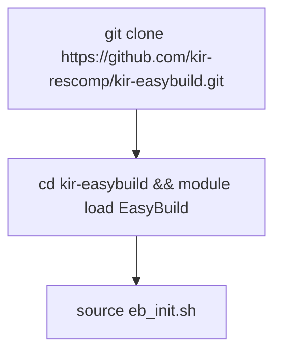

# EasyBuild at KRI 

## Overview
- KIR Research Computing uses Easybuild to provide  SS packages to our researchers
    - [EasyBuild](https://easybuild.io/)  is a software build and installation framework that allows you to manage (scientific) software on High Performance Computing (HPC) systems in an efficient way.
- Researchers can load multiple versions of any software via Environment modules (LMOD)
- All software is built to offer high reproducibilit

